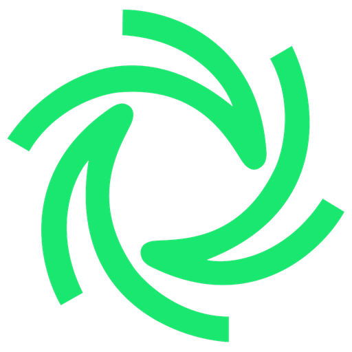

  

# Vortex

Vortex seamlessly bridges Linux desktops and Android devices with zero cloud infrastructure. It delivers bidirectional clipboard sync, universal control, instant file sharing, smart audio handoff, notification mirroring, and screen casting with end-to-end cryptographic security.

> [!NOTE]
> The documentation and codebase guides for this project were written and maintained with the assistance of AI agents.

> [!WARNING]
> **Beta Software**: Vortex is currently under active development. Features, protocol definitions, and platform integrations are actively being tested and refined.

---

## Documentation Index

### Getting Started

| Document | Description |
| :--- | :--- |
| [Installation Guide](docs/getting-started/installation.md) | Nix Flake, Direnv, and platform prerequisites |
| [Pairing & Security](docs/getting-started/pairing.md) | BLE discovery, Noise protocol handshake, and 3-emoji SAS verification |

### System Architecture

| Document | Description |
| :--- | :--- |
| [Architecture Overview](docs/architecture/overview.md) | Core daemon (`vortex-l3d`), Tauri GUI, Android app, and inject helper |
| [Wire & Encryption Protocols](docs/architecture/protocols.md) | Protobuf contracts, ChaCha20-Poly1305 framing, and BLE / Wi-Fi transports |

### Core Features

| Document | Description |
| :--- | :--- |
| [Universal Control](docs/features/universal-control.md) | Wayland `libei` / InputCapture portal, edge crossing, and Android `/dev/uinput` injection |
| [Screen Mirroring & Casting](docs/features/screen-mirroring.md) | Low-latency H.264 GStreamer decoding pipeline and Wayland screencasting |
| [Universal Clipboard](docs/features/clipboard-sync.md) | Real-time clipboard sync with password manager secret filtering |
| [Smart Audio Handoff](docs/features/smart-audio.md) | MPRIS media orchestration, Bluetooth audio tracking, and phone call priority |
| [Instant File Sharing](docs/features/file-sharing.md) | Local Wi-Fi Direct drops, folder packaging, and file manager integration |

### Development & Maintenance

| Document | Description |
| :--- | :--- |
| [Environment & Tooling](docs/development/environment.md) | Reproducible Nix shell, Lefthook pre-commit guards, and formatting standards |
| [Security & Compliance](docs/security-compliance/security.md) | Local-first threat model, Noise XX cryptography, and sandbox privileges |
| [Troubleshooting Guide](docs/operations/troubleshooting.md) | Diagnostics, BlueZ/BLE reconnection, ADB permissions, and Wayland display fixes |

---

## License

This project is licensed under the [GNU General Public License v3.0](LICENSE).
