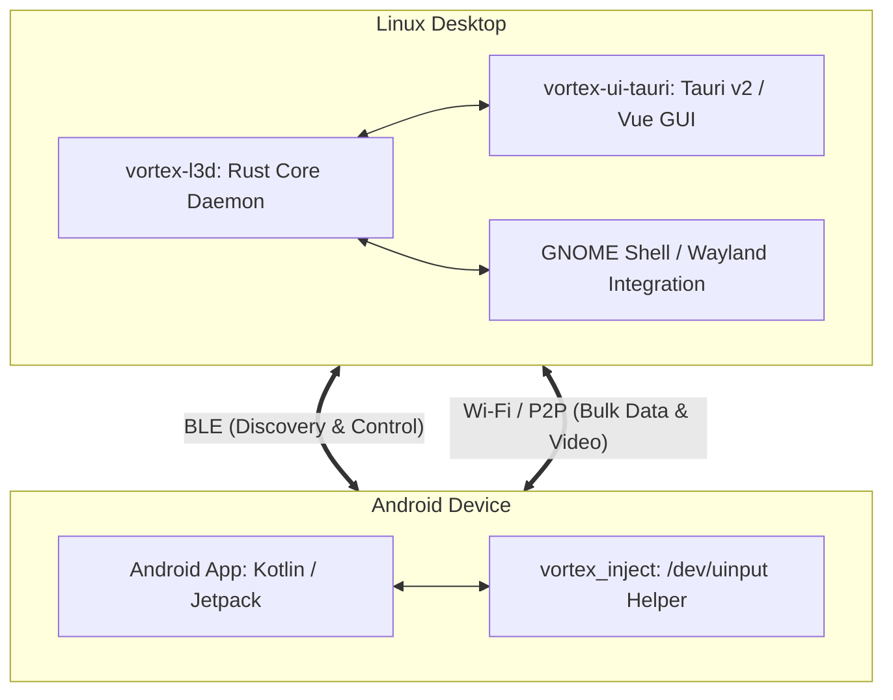

# Architecture overview

Vortex links a Linux desktop and an Android phone over Bluetooth Low Energy and local Wi-Fi.

## Core components

### 1. Rust daemon (`vortex-l3d`)

Located in `linux/daemon/`.

- Establishes encrypted sessions with `snow`, `chacha20poly1305`, and `x25519-dalek`.
- Talks to BlueZ over D-Bus through `bluer` for Bluetooth Low Energy state.
- Reads local audio state through MPRIS D-Bus interfaces.
- Stores pairing identities in Secret Service through `secret-service`.
- Locks the session and triggers remote suspend or poweroff through `org.freedesktop.login1`, with systemctl as fallback.
- Owns transport and alert plumbing with no UI imports. `Noise` sessions, `BLE` discovery, Wi-Fi bulk transfer, `proto` contracts, `notification_display` delivery, `extract_otp` code detection, and `notif_mirror` fan-out live in the daemon. Presentation layers depend on domain-facing contracts only.

### 2. Desktop UI (`vortex-ui-tauri`)

Located in `linux/ui-tauri/`.

The `vortex` tray icon and menu form the primary resident surface. The menu presents connection status, battery rows for buds and phone, recent alerts, call triage entries for answer and decline, copy login code, send files, mirror and clipboard toggles, and quit. The tooltip reports buds and phone percentages. Left-click toggles resident visibility without routing to a page.

The main window serves as a utility surface. The window inventory holds `/`, `/settings`, and `/clipboard`. There is no contacts page, no recents page, no messages or thread page, and no notes page. The retained Vue routes, sidebar entries, and composables match that inventory exactly.

Notification interaction resolves through the tray. SMS and call clicks produce a tray flash with recent-alert recording, a toast describing the tray action, and clipboard handoff where applicable. External opens validate against an allowlist before use. Banner actions and the tray menu provide show, answer, decline, copy-code, and dismiss triage.

- Frontend uses Vue 3, TypeScript, and Vite.
- Backend uses Tauri v2.
- Listens for clipboard changes with `arboard` and `wl-clipboard-rs`, shows the tray icon and notifications, and renders screen video with GStreamer.
- Icons follow the Solar set. UI screens use Linear at stroke 1.5-1.8 from `src/lib/solarIcons.ts`. The brand mark uses Solar Black Hole Bold Duotone from `assets/vortex_solar_source.svg` (see `assets/SOLAR_LICENSE.txt`). Tray and bundle icons are simplified copies of that source for small sizes.
- Pure flat Material UI design language: cards and panels rely strictly on 1dp outline borders and tonal surface backgrounds, completely eliminating all colored drop-shadows, spot-shadow elevation glows, and radial background glow filters for a clean, consistent aesthetic modeled after modern development environments.
- Dynamic system theming: system theme detection queries ricelin/wallcolor (`~/.cache/ricelin/colors.json`) first to retrieve the active desktop wallpaper color palette, with fallback to GNOME `gsettings` accent color and dark mode preference. Local device identity is resolved dynamically from `/proc/sys/kernel/hostname`.

### 3. Android application

Located in `android/app/`.

- Kotlin app built on Android Jetpack, Coroutines, and BLE APIs.
- Sends touch, mouse, and keyboard events through the native helper binary.
- Icons follow the Solar Linear set through `ui/icons/SolarIcons.kt`, with `batteryIconFor` and `lockIconFor` mapping state. Notification and media drawables are redrawn Solar paths on viewport 24 with white fill. Launcher and mipmap icons come from the Solar brand source. Background services use their own Solar drawables instead of system fallbacks, and the app tints the brand logo with the accent color.
- Pure flat Material UI styling: eliminates all elevation spot-shadow glows, unifies card dimensions (`CardCorner` 16dp, `CardHeight` 176dp, 16dp padding, 1dp outline border) across peer devices, headphones, and local phone cards, and enforces consistent top headers with `VortexDivider` across all sub-screens.
- Dynamic Material You system theming: extracts Android 12+ dynamic system primary tokens (`resolveDisplayColor`) for accent chips and controls (replacing hardcoded green switch tracks and indicators), and dynamically resolves the phone's friendly device name to prevent duplicate labels.
- Includes toggles for remote lock, remote suspend, and remote shutdown, each asking for confirmation.

### 4. Input helper (`vortex_inject`)

Located in `android/inject/`.

- Small 20 KB native binary that runs as the Android `shell` user over ADB.
- Opens `/dev/uinput` to expose a virtual touch screen, mouse, and keyboard. No root and no vendor account is needed.

## See also

- `docs/getting-started/installation.md` describes resident tray defaults and autostart.
- `docs/operations/troubleshooting.md` covers tray and notification diagnostics.
- `docs/features/file-sharing.md` describes the tray send path.
- `docs/features/clipboard-sync.md` describes SMS login-code clipboard pass-through.
