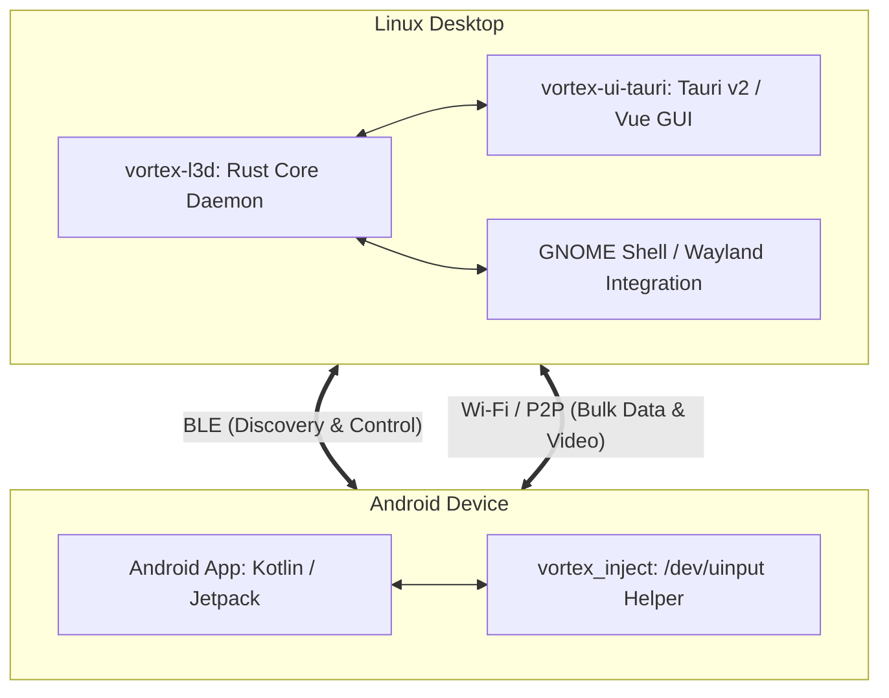

# Architecture overview

Vortex links a Linux desktop and an Android phone over Bluetooth Low Energy and local Wi-Fi.

## Core components

### 1. Rust daemon (`vortex-l3d`)

The daemon in `linux/daemon/` owns headless system integration, transport security, and device coordination:

- Cryptography: establishes encrypted sessions using Noise XX (`snow`, `chacha20poly1305`, and `x25519-dalek`).
- Connectivity: coordinates Bluetooth Low Energy discovery and GATT connections via BlueZ over D-Bus (`bluer`), and establishes local Wi-Fi sockets for high-throughput transfers.
- System integration: monitors desktop media state via MPRIS D-Bus interfaces, persists paired identities in the Secret Service keyring (`secret-service`), and invokes session power management via `org.freedesktop.login1`.
- Boundary isolation: isolates transport framing and serialization from desktop presentation layers, exposing domain-facing IPC contracts without UI dependencies.

### 2. Desktop UI (`vortex-ui-tauri`)

The desktop client in `linux/ui-tauri/` provides the presentation layer and system tray integration:

- Architecture: built on Tauri v2 with a Vue 3 and TypeScript frontend, communicating with the local daemon over IPC.
- Resident tray: runs as a persistent tray indicator that exposes device connection status, peripheral battery levels, quick action toggles, and notification triage.
- Utility window: provides configuration, pairing approval, and clipboard history views without cluttering background workflow.
- Media and peripherals: monitors desktop clipboard selections via `arboard` and `wl-clipboard-rs`, captures Wayland screen streams, and renders remote video feeds through GStreamer.

### 3. Android application

The mobile client in `android/app/` provides background services and device management:

- Architecture: native Kotlin application built on Android Jetpack, Kotlin Coroutines, and Jetpack Compose.
- Background services: maintains BLE advertisement and scanning loops, processes incoming notifications, and transfers clipboard state.
- Remote control: dispatches touch, mouse, and keyboard events across the network to the local injection helper.
- Device security: stores cryptographic keys in Android Keystore, handles out-of-band emoji SAS confirmation, and validates remote session commands.

### 4. Input helper (`vortex_inject`)

The input helper in `android/inject/` bridges network input events to the Android kernel:

- Architecture: lightweight native C binary executed as the Android `shell` user through ADB.
- Kernel interface: creates a virtual touch screen, mouse, and keyboard via `/dev/uinput`.
- Privilege model: operates entirely within standard ADB shell permissions without requiring root access or vendor account privileges.

## See also

- `docs/architecture/protocols.md` details protobuf contracts, ChaCha20-Poly1305 framing, and transport handshakes.
- `docs/getting-started/installation.md` describes desktop and Android client installation.
- `docs/operations/troubleshooting.md` covers connection diagnostics, BlueZ troubleshooting, and input debugging.
- `docs/features/universal-control.md` describes desktop input capture and remote injection.
