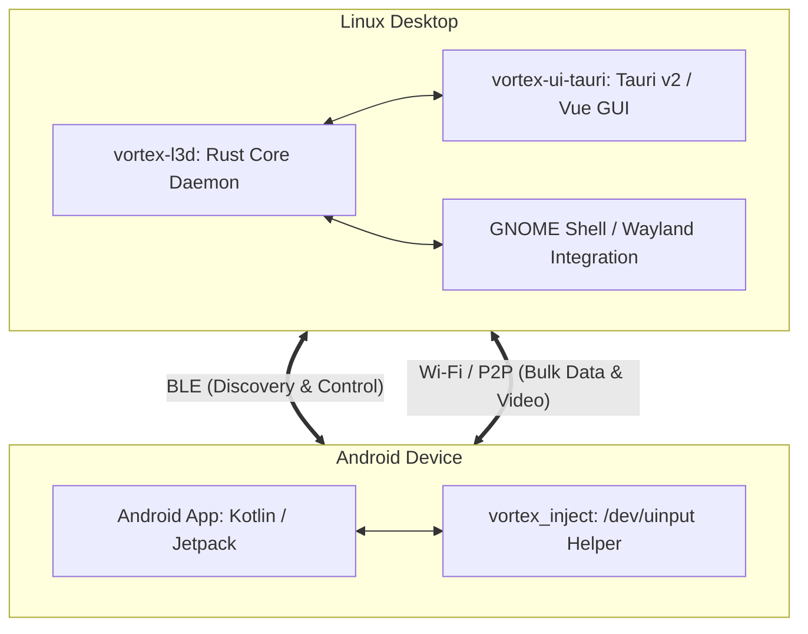

# Architecture Overview

Vortex connects Linux desktops and Android mobile devices with low-latency local communication.

## Core Components

### 1. Rust Daemon (`vortex-l3d`)
Located in `linux/daemon/`.
- Handles cryptographic session establishment (`snow`, `chacha20poly1305`, `x25519-dalek`).
- Manages Bluetooth Low Energy state via `bluer` and BlueZ D-Bus APIs.
- Controls local audio state via MPRIS D-Bus interfaces.
- Integrates with Secret Service (`secret-service`) to protect pairing identities.

### 2. Desktop UI (`vortex-ui-tauri`)
Located in `linux/ui-tauri/`.
- Frontend built with Vue 3, TypeScript, and Vite.
- Backend implemented with Tauri v2.
- Handles system tray icon, notifications, clipboard listening (`arboard` and `wl-clipboard-rs`), and GStreamer screen rendering.
- Artwork uses the Solar family: UI screens stay Linear locked at stroke 1.5-1.8 via `src/lib/solarIcons.ts`, while the brand mark is Solar Black Hole Bold Duotone sourced from `assets/vortex_solar_source.svg` (see `assets/SOLAR_LICENSE.txt`). Tauri tray plus bundle icons are regenerated from that source with monochrome simplification for status targets.

### 3. Android Application
Located in `android/app/`.
- Native Kotlin application utilizing Android Jetpack, Coroutines, and BLE APIs.
- Communicates with the native helper binary to inject touch, mouse, and keyboard input.
- Artwork uses the Solar Linear family via `ui/icons/SolarIcons.kt` with `batteryIconFor` plus `lockIconFor` state mapping. Notification plus media `drawable` vectors are redrawn from Solar paths on viewport 24 with white fill, and launcher foregrounds are regenerated from the Solar brand source.

### 4. Input Injection Helper (`vortex_inject`)
Located in `android/inject/`.
- Compact 20 KB native binary executing under Android's `shell` user context via ADB.
- Interfaces directly with `/dev/uinput` to provide low-latency virtual input without requiring root or vendor accounts.
